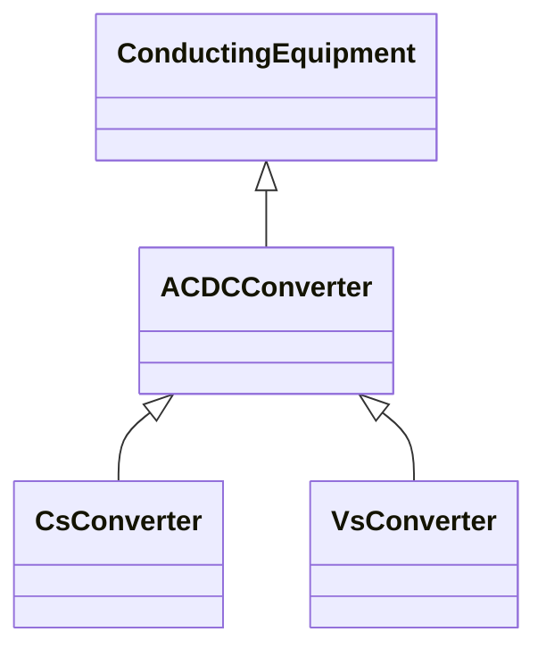

# ACDCConverter

A unit with valves for three phases, together with unit control equipment, essential protective and switching devices, DC storage capacitors, phase reactors and auxiliaries, if any, used for conversion.

## Inheritance

<button class="mermaid-enlarge-button">Enlarge Diagram</button>

## Attributes

| Label | Type | Multiplicity | Comment |
|-------|------|--------------|---------|
| DCTerminals | [ACDCConverterDCTerminal](ACDCConverterDCTerminal.md) | 0..n | A DC converter have DC converter terminals. A converter has two DC converter terminals. |
| PccTerminal | [Terminal](Terminal.md) | 0..1 | Point of common coupling terminal for this converter DC side. It is typically the terminal on the power transformer (or switch) closest to the AC network. |
| baseS | Float | 0..1 | Base apparent power of the converter pole. The attribute shall be a positive value. |
| idc | Float | 1..1 | Converter DC current, also called Id. It is converter’s state variable, result from power flow. |
| idleLoss | Float | 0..1 | Active power loss in pole at no power transfer. It is converter’s configuration data used in power flow. The attribute shall be a positive value. |
| maxP | Float | 0..1 | Maximum active power limit. The value is overwritten by values of VsCapabilityCurve, if present. |
| maxUdc | Float | 0..1 | The maximum voltage on the DC side at which the converter should operate. It is converter’s configuration data used in power flow. The attribute shall be a positive value. |
| minP | Float | 0..1 | Minimum active power limit. The value is overwritten by values of VsCapabilityCurve, if present. |
| minUdc | Float | 0..1 | The minimum voltage on the DC side at which the converter should operate. It is converter’s configuration data used in power flow. The attribute shall be a positive value. |
| numberOfValves | Integer | 0..1 | Number of valves in the converter. Used in loss calculations. |
| p | Float | 1..1 | Active power at the point of common coupling. Load sign convention is used, i.e. positive sign means flow out from a node. Starting value for a steady state solution in the case a simplified power flow model is used. |
| poleLossP | Float | 1..1 | The active power loss at a DC Pole = idleLoss + switchingLoss*|Idc| + resitiveLoss*Idc^2. For lossless operation Pdc=Pac. For rectifier operation with losses Pdc=Pac-lossP. For inverter operation with losses Pdc=Pac+lossP. It is converter’s state variable used in power flow. The attribute shall be a positive value. |
| q | Float | 1..1 | Reactive power at the point of common coupling. Load sign convention is used, i.e. positive sign means flow out from a node. Starting value for a steady state solution in the case a simplified power flow model is used. |
| ratedUdc | Float | 0..1 | Rated converter DC voltage, also called UdN. The attribute shall be a positive value. It is converter’s configuration data used in power flow. For instance a bipolar HVDC link with value 200 kV has a 400kV difference between the dc lines. |
| resistiveLoss | Float | 0..1 | It is converter’s configuration data used in power flow. Refer to poleLossP. The attribute shall be a positive value. |
| switchingLoss | Float | 0..1 | Switching losses, relative to the base apparent power 'baseS'. Refer to poleLossP. The attribute shall be a positive value. |
| targetPpcc | Float | 0..1 | Real power injection target in AC grid, at point of common coupling. Load sign convention is used, i.e. positive sign means flow out from a node. |
| targetUdc | Float | 0..1 | Target value for DC voltage magnitude. The attribute shall be a positive value. |
| uc | Float | 1..1 | Line-to-line converter voltage, the voltage at the AC side of the valve. It is converter’s state variable, result from power flow. The attribute shall be a positive value. |
| udc | Float | 1..1 | Converter voltage at the DC side, also called Ud. It is converter’s state variable, result from power flow. The attribute shall be a positive value. |
| valveU0 | Float | 0..1 | Valve threshold voltage, also called Uvalve. Forward voltage drop when the valve is conducting. Used in loss calculations, i.e. the switchLoss depend on numberOfValves * valveU0. |

