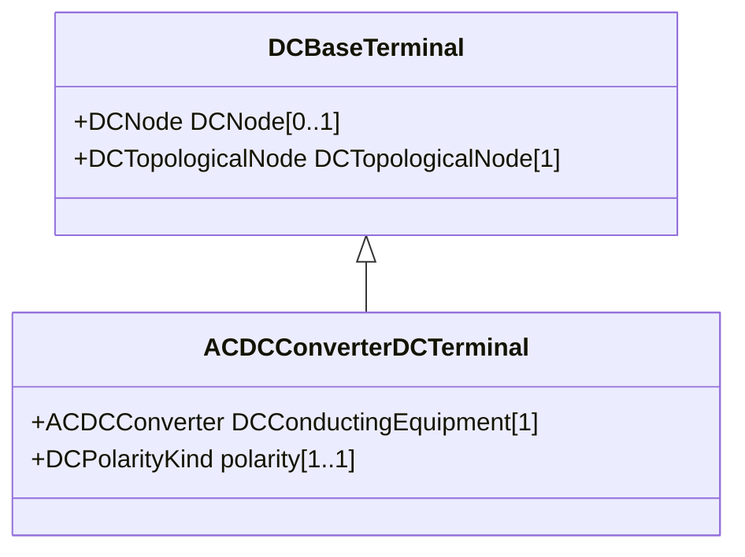

# ACDCConverterDCTerminal

A DC electrical connection point at the AC/DC converter. The AC/DC converter is electrically connected also to the AC side. The AC connection is inherited from the AC conducting equipment in the same way as any other AC equipment. The AC/DC converter DC terminal is separate from generic DC terminal to restrict the connection with the AC side to AC/DC converter and so that no other DC conducting equipment can be connected to the AC side.

## Inheritance

<button class="mermaid-enlarge-button">Enlarge Diagram</button>

## Attributes

| Label | Type | Multiplicity | Comment |
|-------|------|--------------|---------|
| DCConductingEquipment | [ACDCConverter](ACDCConverter.md) | 1 | A DC converter terminal belong to an DC converter. |
| polarity | [DCPolarityKind](DCPolarityKind.md) | 1..1 | Represents the normal network polarity condition. Depending on the converter configuration the value shall be set as follows: - For a monopole with two converter terminals use DCPolarityKind “positive” and “negative”. - For a bi-pole or symmetric monopole with three converter terminals use DCPolarityKind “positive”, “middle” and “negative”. |

