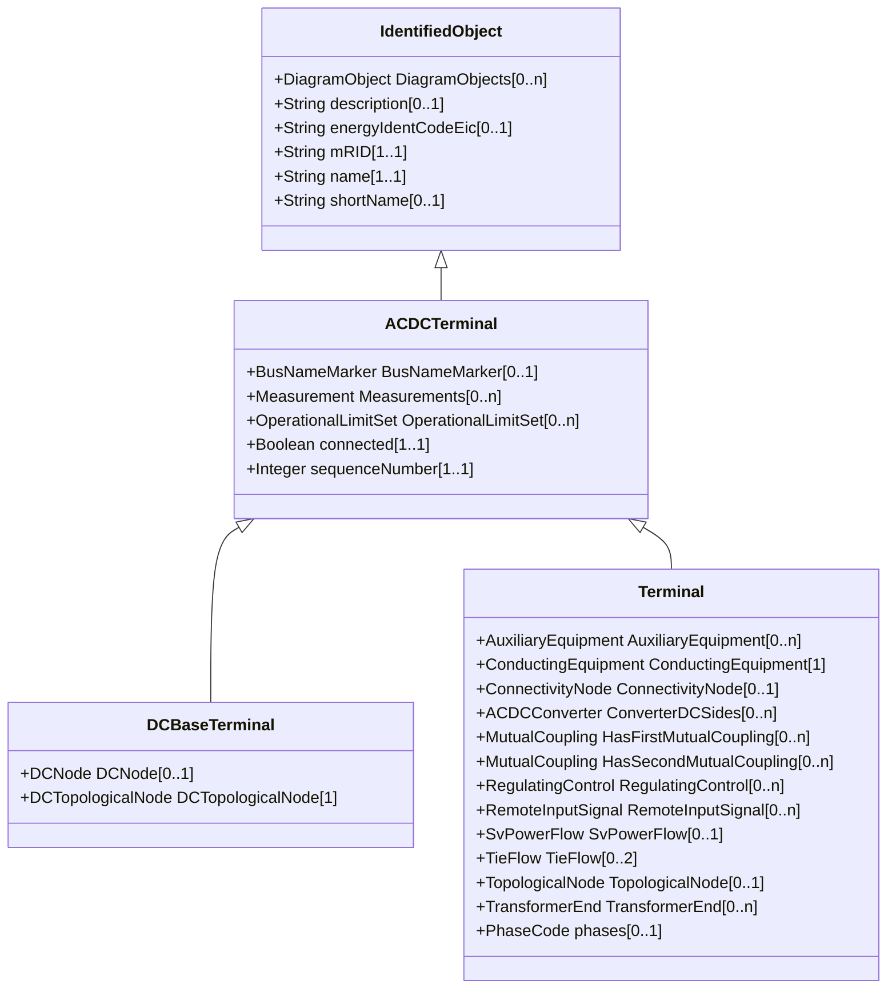

# ACDCTerminal

An electrical connection point (AC or DC) to a piece of conducting equipment. Terminals are connected at physical connection points called connectivity nodes.

## Inheritance

<button class="mermaid-enlarge-button">Enlarge Diagram</button>

## Attributes

| Label | Type | Multiplicity | Comment |
|-------|------|--------------|---------|
| BusNameMarker | [BusNameMarker](BusNameMarker.md) | 0..1 | The bus name marker used to name the bus (topological node). |
| Measurements | [Measurement](Measurement.md) | 0..n | Measurements associated with this terminal defining where the measurement is placed in the network topology. It may be used, for instance, to capture the sensor position, such as a voltage transformer (PT) at a busbar or a current transformer (CT) at the bar between a breaker and an isolator. |
| OperationalLimitSet | [OperationalLimitSet](OperationalLimitSet.md) | 0..n | The operational limit sets at the terminal. |
| connected | Boolean | 1..1 | The connected status is related to a bus-branch model and the topological node to terminal relation. True implies the terminal is connected to the related topological node and false implies it is not. In a bus-branch model, the connected status is used to tell if equipment is disconnected without having to change the connectivity described by the topological node to terminal relation. A valid case is that conducting equipment can be connected in one end and open in the other. In particular for an AC line segment, where the reactive line charging can be significant, this is a relevant case. |
| sequenceNumber | Integer | 1..1 | The orientation of the terminal connections for a multiple terminal conducting equipment. The sequence numbering starts with 1 and additional terminals should follow in increasing order. The first terminal is the 'starting point' for a two terminal branch. |

