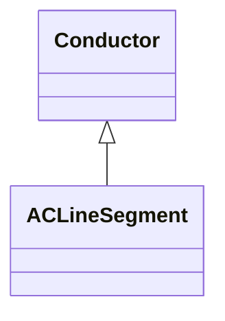

# ACLineSegment

A wire or combination of wires, with consistent electrical characteristics, building a single electrical system, used to carry alternating current between points in the power system. For symmetrical, transposed three phase lines, it is sufficient to use attributes of the line segment, which describe impedances and admittances for the entire length of the segment. Additionally impedances can be computed by using length and associated per length impedances. The BaseVoltage at the two ends of ACLineSegments in a Line shall have the same BaseVoltage.nominalVoltage. However, boundary lines may have slightly different BaseVoltage.nominalVoltages and variation is allowed. Larger voltage difference in general requires use of an equivalent branch.

## Inheritance

<button class="mermaid-enlarge-button">Enlarge Diagram</button>

## Attributes

| Label | Type | Multiplicity | Comment |
|-------|------|--------------|---------|
| Clamp | [Clamp](Clamp.md) | 0..n | The clamps connected to the line segment. |
| Cut | [Cut](Cut.md) | 0..n | Cuts applied to the line segment. |
| b0ch | Float | 1..1 | Zero sequence shunt (charging) susceptance, uniformly distributed, of the entire line section. |
| bch | Float | 1..1 | Positive sequence shunt (charging) susceptance, uniformly distributed, of the entire line section. This value represents the full charging over the full length of the line. |
| g0ch | Float | 1..1 | Zero sequence shunt (charging) conductance, uniformly distributed, of the entire line section. |
| gch | Float | 0..1 | Positive sequence shunt (charging) conductance, uniformly distributed, of the entire line section. |
| r | Float | 1..1 | Positive sequence series resistance of the entire line section. |
| r0 | Float | 1..1 | Zero sequence series resistance of the entire line section. |
| shortCircuitEndTemperature | Float | 1..1 | Maximum permitted temperature at the end of SC for the calculation of minimum short-circuit currents. Used for short circuit data exchange according to IEC 60909. |
| x | Float | 1..1 | Positive sequence series reactance of the entire line section. |
| x0 | Float | 1..1 | Zero sequence series reactance of the entire line section. |

