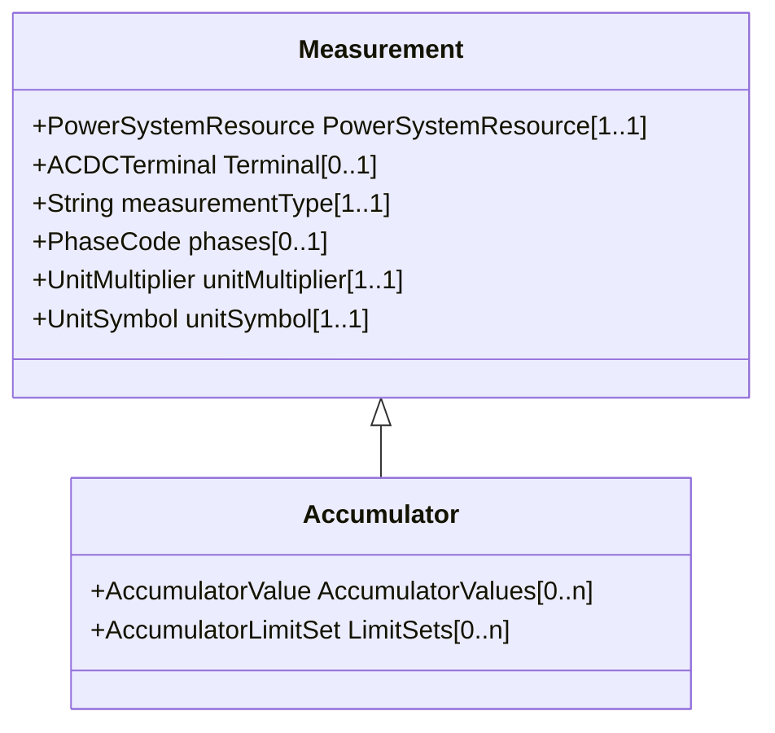

# Accumulator

Accumulator represents an accumulated (counted) Measurement, e.g. an energy value.

## Inheritance

<button class="mermaid-enlarge-button">Enlarge Diagram</button>

## Attributes

| Label | Type | Multiplicity | Comment |
|-------|------|--------------|---------|
| AccumulatorValues | [AccumulatorValue](AccumulatorValue.md) | 0..n | The values connected to this measurement. |
| LimitSets | [AccumulatorLimitSet](AccumulatorLimitSet.md) | 0..n | A measurement may have zero or more limit ranges defined for it. |

