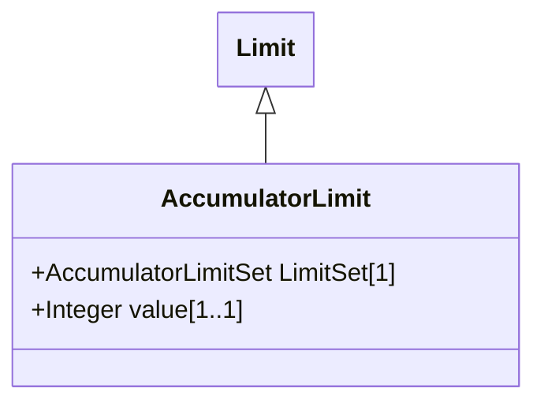

# AccumulatorLimit

Limit values for Accumulator measurements.

## Inheritance

<button class="mermaid-enlarge-button">Enlarge Diagram</button>

## Attributes

| Label | Type | Multiplicity | Comment |
|-------|------|--------------|---------|
| LimitSet | [AccumulatorLimitSet](AccumulatorLimitSet.md) | 1 | The set of limits. |
| value | Integer | 1..1 | The value to supervise against. The value is positive. |

