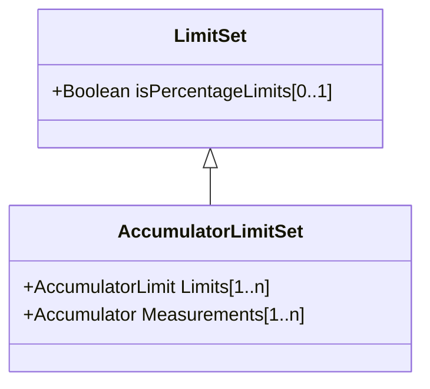

# AccumulatorLimitSet

An AccumulatorLimitSet specifies a set of Limits that are associated with an Accumulator measurement.

## Inheritance

<button class="mermaid-enlarge-button">Enlarge Diagram</button>

## Attributes

| Label | Type | Multiplicity | Comment |
|-------|------|--------------|---------|
| Limits | [AccumulatorLimit](AccumulatorLimit.md) | 1..n | The limit values used for supervision of Measurements. |
| Measurements | [Accumulator](Accumulator.md) | 1..n | The Measurements using the LimitSet. |

