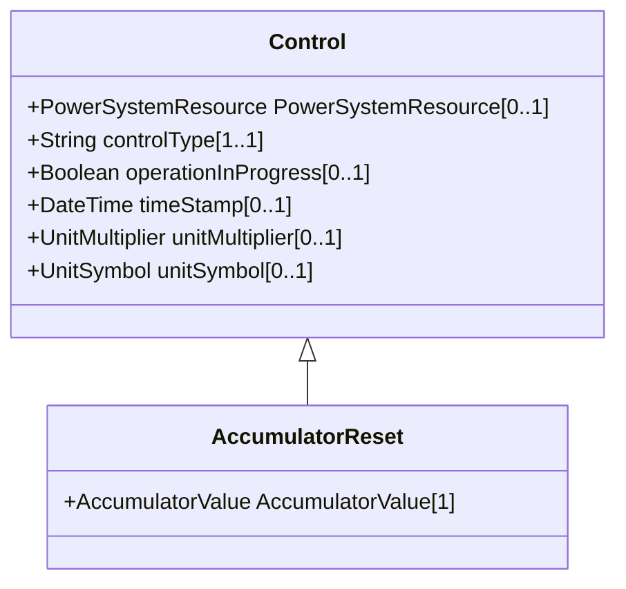

# AccumulatorReset

This command resets the counter value to zero.

## Inheritance

<button class="mermaid-enlarge-button">Enlarge Diagram</button>

## Attributes

| Label | Type | Multiplicity | Comment |
|-------|------|--------------|---------|
| AccumulatorValue | [AccumulatorValue](AccumulatorValue.md) | 1 | The accumulator value that is reset by the command. |

