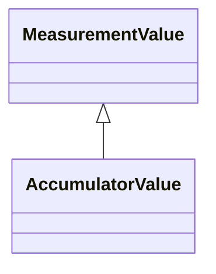

# AccumulatorValue

AccumulatorValue represents an accumulated (counted) MeasurementValue.

## Inheritance

<button class="mermaid-enlarge-button">Enlarge Diagram</button>

## Attributes

| Label | Type | Multiplicity | Comment |
|-------|------|--------------|---------|
| Accumulator | [Accumulator](Accumulator.md) | 1 | Measurement to which this value is connected. |
| AccumulatorReset | [AccumulatorReset](AccumulatorReset.md) | 0..1 | The command that resets the accumulator value. |

