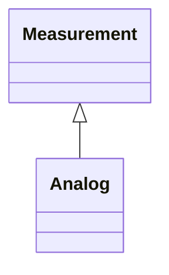

# Analog

Analog represents an analog Measurement.

## Inheritance

<button class="mermaid-enlarge-button">Enlarge Diagram</button>

## Attributes

| Label | Type | Multiplicity | Comment |
|-------|------|--------------|---------|
| AnalogValues | [AnalogValue](AnalogValue.md) | 0..n | The values connected to this measurement. |
| LimitSets | [AnalogLimitSet](AnalogLimitSet.md) | 0..n | A measurement may have zero or more limit ranges defined for it. |
| positiveFlowIn | Boolean | 0..1 | If true then this measurement is an active power, reactive power or current with the convention that a positive value measured at the Terminal means power is flowing into the related PowerSystemResource. |

