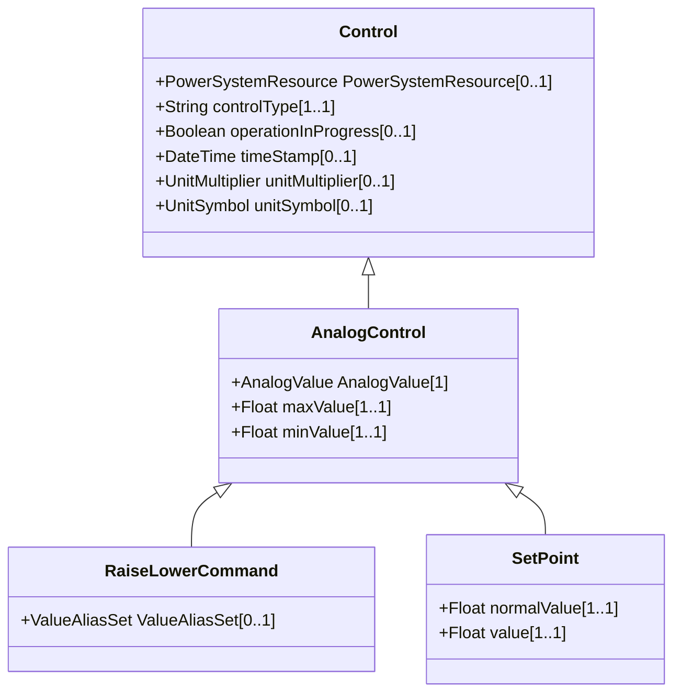

# AnalogControl

An analog control used for supervisory control.

## Inheritance

<button class="mermaid-enlarge-button">Enlarge Diagram</button>

## Attributes

| Label | Type | Multiplicity | Comment |
|-------|------|--------------|---------|
| AnalogValue | [AnalogValue](AnalogValue.md) | 1 | The MeasurementValue that is controlled. |
| maxValue | Float | 1..1 | Normal value range maximum for any of the Control.value. Used for scaling, e.g. in bar graphs. |
| minValue | Float | 1..1 | Normal value range minimum for any of the Control.value. Used for scaling, e.g. in bar graphs. |

