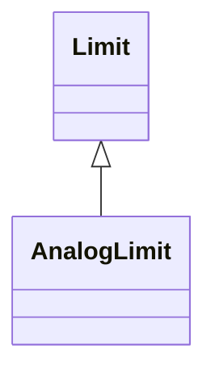

# AnalogLimit

Limit values for Analog measurements.

## Inheritance

<button class="mermaid-enlarge-button">Enlarge Diagram</button>

## Attributes

| Label | Type | Multiplicity | Comment |
|-------|------|--------------|---------|
| LimitSet | [AnalogLimitSet](AnalogLimitSet.md) | 1 | The set of limits. |
| value | Float | 1..1 | The value to supervise against. |

