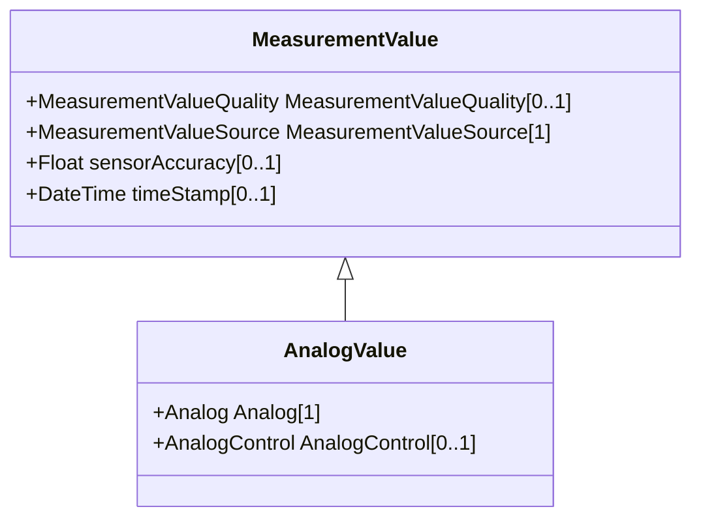

# AnalogValue

AnalogValue represents an analog MeasurementValue.

## Inheritance

<button class="mermaid-enlarge-button">Enlarge Diagram</button>

## Attributes

| Label | Type | Multiplicity | Comment |
|-------|------|--------------|---------|
| Analog | [Analog](Analog.md) | 1 | Measurement to which this value is connected. |
| AnalogControl | [AnalogControl](AnalogControl.md) | 0..1 | The Control variable associated with the MeasurementValue. |

