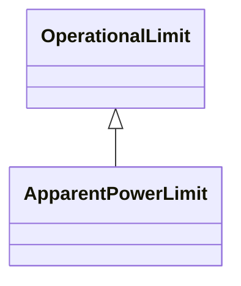

# ApparentPowerLimit

Apparent power limit.

## Inheritance

<button class="mermaid-enlarge-button">Enlarge Diagram</button>

## Attributes

| Label | Type | Multiplicity | Comment |
|-------|------|--------------|---------|
| normalValue | Float | 1..1 | The normal apparent power limit. The attribute shall be a positive value or zero. |
| value | Float | 1..1 | The apparent power limit. The attribute shall be a positive value or zero. |

