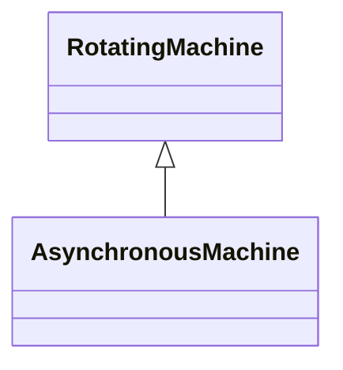

# AsynchronousMachine

A rotating machine whose shaft rotates asynchronously with the electrical field. Also known as an induction machine with no external connection to the rotor windings, e.g. squirrel-cage induction machine.

## Inheritance

<button class="mermaid-enlarge-button">Enlarge Diagram</button>

## Attributes

| Label | Type | Multiplicity | Comment |
|-------|------|--------------|---------|
| AsynchronousMachineDynamics | [AsynchronousMachineDynamics](AsynchronousMachineDynamics.md) | 0..1 | Asynchronous machine dynamics model used to describe dynamic behaviour of this asynchronous machine. |
| asynchronousMachineType | [AsynchronousMachineKind](AsynchronousMachineKind.md) | 1..1 | Indicates the type of Asynchronous Machine (motor or generator). |
| converterFedDrive | Boolean | 1..1 | Indicates whether the machine is a converter fed drive. Used for short circuit data exchange according to IEC 60909. |
| efficiency | Float | 1..1 | Efficiency of the asynchronous machine at nominal operation as a percentage. Indicator for converter drive motors. Used for short circuit data exchange according to IEC 60909. |
| iaIrRatio | Float | 1..1 | Ratio of locked-rotor current to the rated current of the motor (Ia/Ir). Used for short circuit data exchange according to IEC 60909. |
| nominalFrequency | Float | 0..1 | Nameplate data indicates if the machine is 50 Hz or 60 Hz. |
| nominalSpeed | Float | 0..1 | Nameplate data. Depends on the slip and number of pole pairs. |
| polePairNumber | Integer | 1..1 | Number of pole pairs of stator. Used for short circuit data exchange according to IEC 60909. |
| ratedMechanicalPower | Float | 1..1 | Rated mechanical power (Pr in IEC 60909-0). Used for short circuit data exchange according to IEC 60909. |
| reversible | Boolean | 1..1 | Indicates for converter drive motors if the power can be reversible. Used for short circuit data exchange according to IEC 60909. |
| rxLockedRotorRatio | Float | 0..1 | Locked rotor ratio (R/X). Used for short circuit data exchange according to IEC 60909. |

