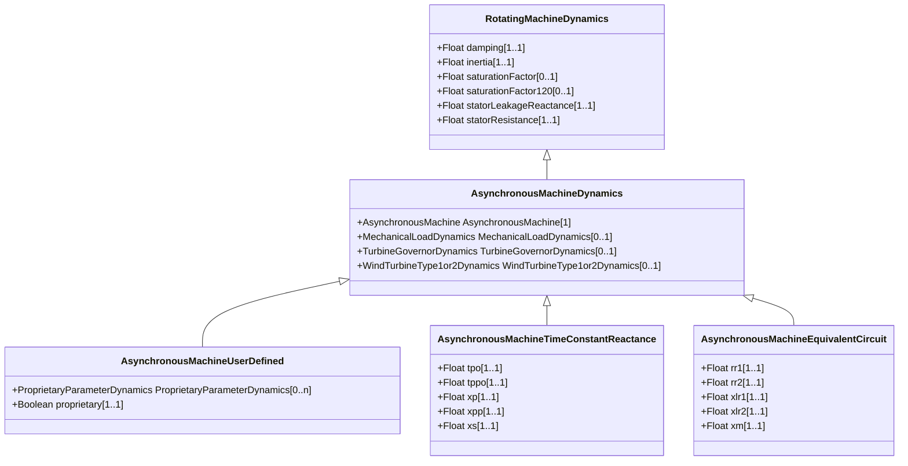

# AsynchronousMachineDynamics

Asynchronous machine whose behaviour is described by reference to a standard model expressed in either time constant reactance form or equivalent circuit form or by definition of a user-defined model. Parameter details: Asynchronous machine parameters such as Xl, Xs, etc. are actually used as inductances in the model, but are commonly referred to as reactances since, at nominal frequency, the PU values are the same. However, some references use the symbol L instead of X.

## Inheritance

<button class="mermaid-enlarge-button">Enlarge Diagram</button>

## Attributes

| Label | Type | Multiplicity | Comment |
|-------|------|--------------|---------|
| AsynchronousMachine | [AsynchronousMachine](AsynchronousMachine.md) | 1 | Asynchronous machine to which this asynchronous machine dynamics model applies. |
| MechanicalLoadDynamics | [MechanicalLoadDynamics](MechanicalLoadDynamics.md) | 0..1 | Mechanical load model associated with this asynchronous machine model. |
| TurbineGovernorDynamics | [TurbineGovernorDynamics](TurbineGovernorDynamics.md) | 0..1 | Turbine-governor model associated with this asynchronous machine model. |
| WindTurbineType1or2Dynamics | [WindTurbineType1or2Dynamics](WindTurbineType1or2Dynamics.md) | 0..1 | Wind generator type 1 or type 2 model associated with this asynchronous machine model. |

