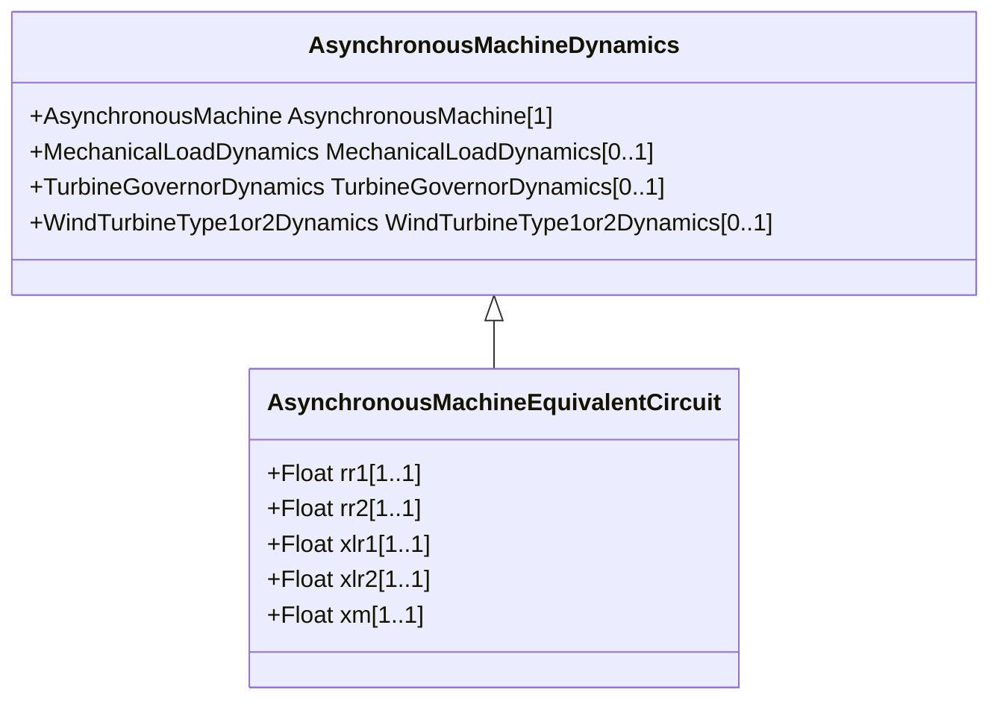

# AsynchronousMachineEquivalentCircuit

The electrical equations of all variations of the asynchronous model are based on the AsynchronousEquivalentCircuit diagram for the direct- and quadrature- axes, with two equivalent rotor windings in each axis. Equations for conversion between equivalent circuit and time constant reactance forms: Xs = Xm + Xl X' = Xl + Xm x Xlr1 / (Xm + Xlr1) X'' = Xl + Xm x Xlr1 x Xlr2 / (Xm x Xlr1 + Xm x Xlr2 + Xlr1 x Xlr2) T'o = (Xm + Xlr1) / (omega0 x Rr1) T''o = (Xm x Xlr1 + Xm x Xlr2 + Xlr1 x Xlr2) / (omega0 x Rr2 x (Xm + Xlr1) Same equations using CIM attributes from AsynchronousMachineTimeConstantReactance class on left of '=' and AsynchronousMachineEquivalentCircuit class on right (except as noted): xs = xm + RotatingMachineDynamics.statorLeakageReactance xp = RotatingMachineDynamics.statorLeakageReactance + xm x xlr1 / (xm + xlr1) xpp = RotatingMachineDynamics.statorLeakageReactance + xm x xlr1 x xlr2 / (xm x xlr1 + xm x xlr2 + xlr1 x xlr2) tpo = (xm + xlr1) / (2 x pi x nominal frequency x rr1) tppo = (xm x xlr1 + xm x xlr2 + xlr1 x xlr2) / (2 x pi x nominal frequency x rr2 x (xm + xlr1).

## Inheritance

<button class="mermaid-enlarge-button">Enlarge Diagram</button>

## Attributes

| Label | Type | Multiplicity | Comment |
|-------|------|--------------|---------|
| rr1 | Float | 1..1 | Damper 1 winding resistance. |
| rr2 | Float | 1..1 | Damper 2 winding resistance. |
| xlr1 | Float | 1..1 | Damper 1 winding leakage reactance. |
| xlr2 | Float | 1..1 | Damper 2 winding leakage reactance. |
| xm | Float | 1..1 | Magnetizing reactance. |

