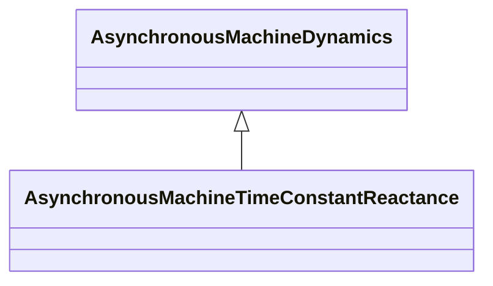

# AsynchronousMachineTimeConstantReactance

Parameter details: If X'' = X', a single cage (one equivalent rotor winding per axis) is modelled. The “p” in the attribute names is a substitution for a “prime” in the usual parameter notation, e.g. tpo refers to T'o. The parameters used for models expressed in time constant reactance form include: - RotatingMachine.ratedS (MVAbase); - RotatingMachineDynamics.damping (D); - RotatingMachineDynamics.inertia (H); - RotatingMachineDynamics.saturationFactor (S1); - RotatingMachineDynamics.saturationFactor120 (S12); - RotatingMachineDynamics.statorLeakageReactance (Xl); - RotatingMachineDynamics.statorResistance (Rs); - .xs (Xs); - .xp (X'); - .xpp (X''); - .tpo (T'o); - .tppo (T''o).

## Inheritance

<button class="mermaid-enlarge-button">Enlarge Diagram</button>

## Attributes

| Label | Type | Multiplicity | Comment |
|-------|------|--------------|---------|
| tpo | Float | 1..1 | Transient rotor time constant (T'o) (> AsynchronousMachineTimeConstantReactance.tppo). Typical value = 5. |
| tppo | Float | 1..1 | Subtransient rotor time constant (T''o) (> 0). Typical value = 0,03. |
| xp | Float | 1..1 | Transient reactance (unsaturated) (X') (>= AsynchronousMachineTimeConstantReactance.xpp). Typical value = 0,5. |
| xpp | Float | 1..1 | Subtransient reactance (unsaturated) (X'') (> RotatingMachineDynamics.statorLeakageReactance). Typical value = 0,2. |
| xs | Float | 1..1 | Synchronous reactance (Xs) (>= AsynchronousMachineTimeConstantReactance.xp). Typical value = 1,8. |

