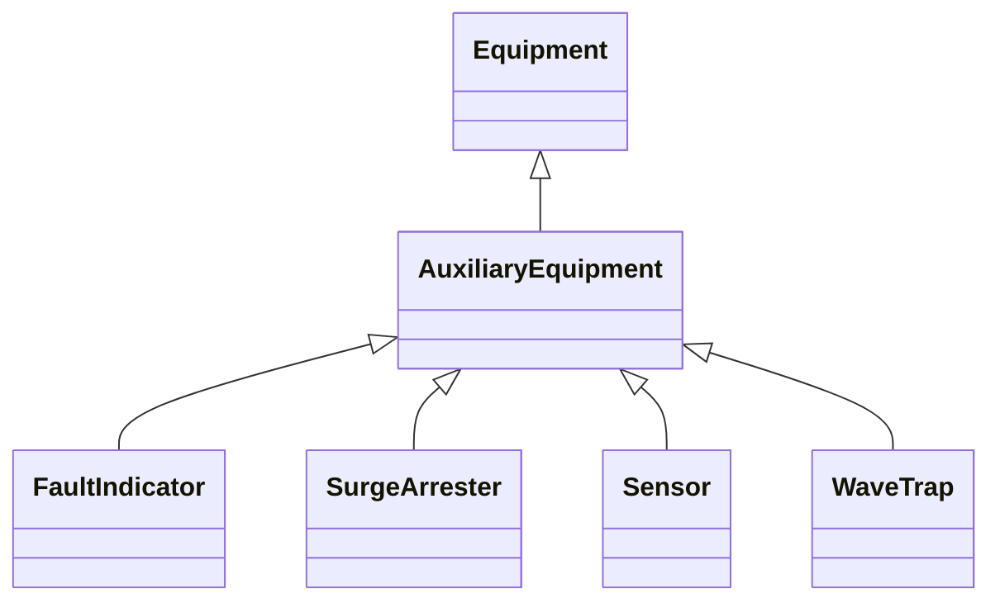

# AuxiliaryEquipment

AuxiliaryEquipment describe equipment that is not performing any primary functions but support for the equipment performing the primary function. AuxiliaryEquipment is attached to primary equipment via an association with Terminal.

## Inheritance

<button class="mermaid-enlarge-button">Enlarge Diagram</button>

## Attributes

| Label | Type | Multiplicity | Comment |
|-------|------|--------------|---------|
| Terminal | [Terminal](Terminal.md) | 1 | The Terminal at the equipment where the AuxiliaryEquipment is attached. |

