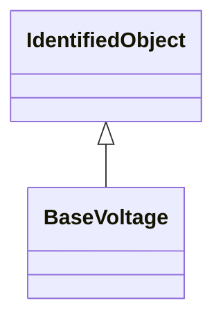

# BaseVoltage

Defines a system base voltage which is referenced.

## Inheritance

<button class="mermaid-enlarge-button">Enlarge Diagram</button>

## Attributes

| Label | Type | Multiplicity | Comment |
|-------|------|--------------|---------|
| ConductingEquipment | [ConductingEquipment](ConductingEquipment.md) | 0..n | All conducting equipment with this base voltage. Use only when there is no voltage level container used and only one base voltage applies. For example, not used for transformers. |
| TopologicalNode | [TopologicalNode](TopologicalNode.md) | 0..n | The topological nodes at the base voltage. |
| TransformerEnds | [TransformerEnd](TransformerEnd.md) | 0..n | Transformer ends at the base voltage. This is essential for PU calculation. |
| VoltageLevel | [VoltageLevel](VoltageLevel.md) | 0..n | The voltage levels having this base voltage. |
| nominalVoltage | Float | 1..1 | The power system resource's base voltage. Shall be a positive value and not zero. |

