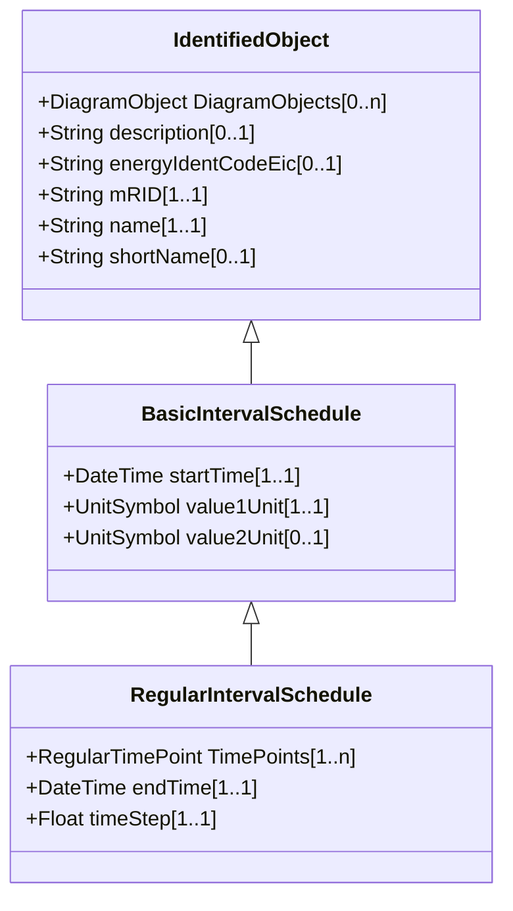

# BasicIntervalSchedule

Schedule of values at points in time.

## Inheritance

<button class="mermaid-enlarge-button">Enlarge Diagram</button>

## Attributes

| Label | Type | Multiplicity | Comment |
|-------|------|--------------|---------|
| startTime | DateTime | 1..1 | The time for the first time point. The value can be a time of day, not a specific date. |
| value1Unit | [UnitSymbol](UnitSymbol.md) | 1..1 | Value1 units of measure. |
| value2Unit | [UnitSymbol](UnitSymbol.md) | 0..1 | Value2 units of measure. |

