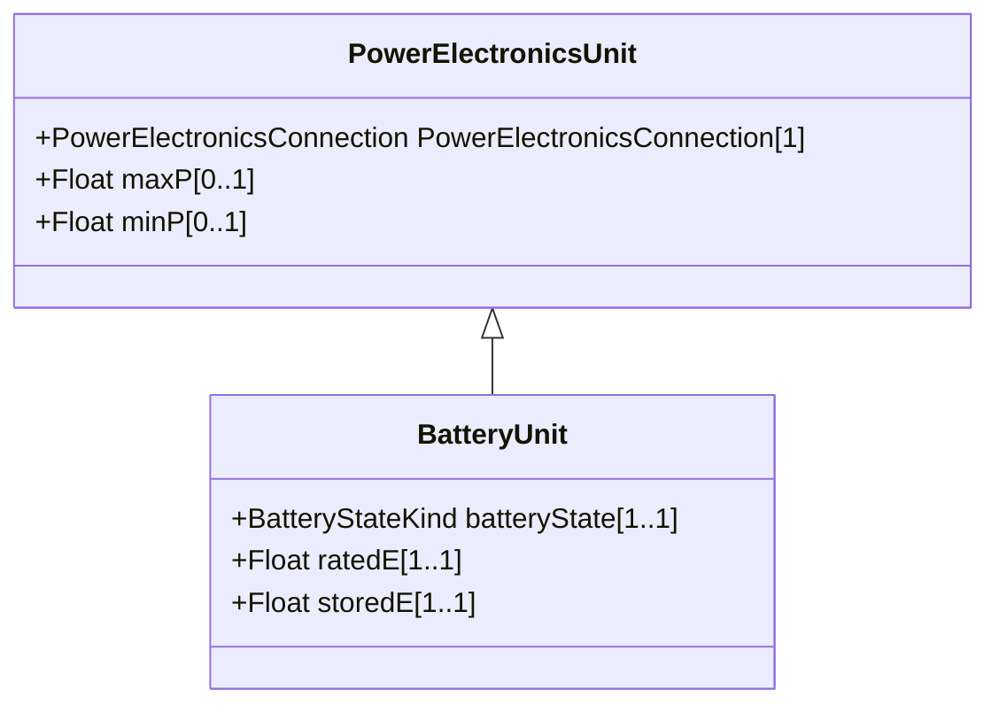

# BatteryUnit

An electrochemical energy storage device.

## Inheritance

<button class="mermaid-enlarge-button">Enlarge Diagram</button>

## Attributes

| Label | Type | Multiplicity | Comment |
|-------|------|--------------|---------|
| batteryState | [BatteryStateKind](BatteryStateKind.md) | 1..1 | The current state of the battery (charging, full, etc.). |
| ratedE | Float | 1..1 | Full energy storage capacity of the battery. The attribute shall be a positive value. |
| storedE | Float | 1..1 | Amount of energy currently stored. The attribute shall be a positive value or zero and lower than BatteryUnit.ratedE. |

