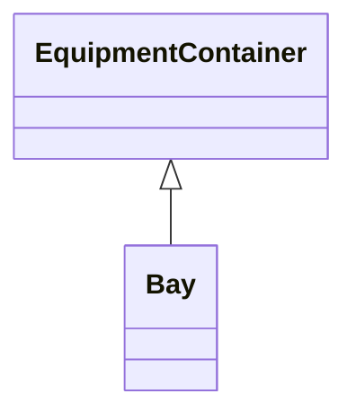

# Bay

A collection of power system resources (within a given substation) including conducting equipment, protection relays, measurements, and telemetry. A bay typically represents a physical grouping related to modularization of equipment.

## Inheritance

<button class="mermaid-enlarge-button">Enlarge Diagram</button>

## Attributes

| Label | Type | Multiplicity | Comment |
|-------|------|--------------|---------|
| VoltageLevel | [VoltageLevel](VoltageLevel.md) | 1 | The voltage level containing this bay. |

