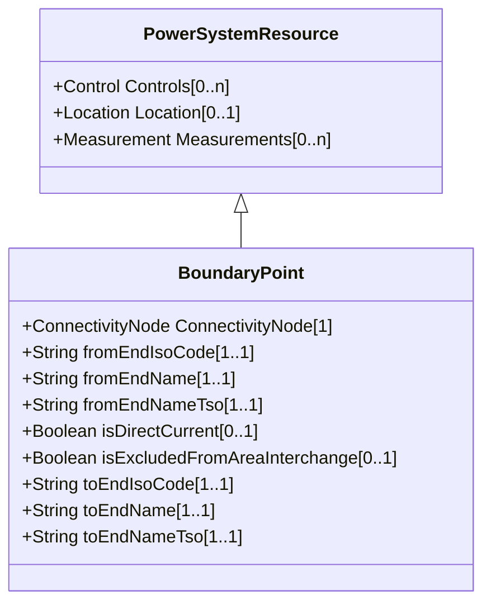

# BoundaryPoint

Designates a connection point at which one or more model authority sets shall connect to. The location of the connection point as well as other properties are agreed between organisations responsible for the interconnection, hence all attributes of the class represent this agreement. It is primarily used in a boundary model authority set which can contain one or many BoundaryPoint-s among other Equipment-s and their connections.

## Inheritance

<button class="mermaid-enlarge-button">Enlarge Diagram</button>

## Attributes

| Label | Type | Multiplicity | Comment |
|-------|------|--------------|---------|
| ConnectivityNode | [ConnectivityNode](ConnectivityNode.md) | 1 | The connectivity node that is designated as a boundary point. |
| fromEndIsoCode | String | 1..1 | The ISO code of the region which the 'From' side of the Boundary point belongs to or it is connected to. The ISO code is a two-character country code as defined by ISO 3166 (http://www.iso.org/iso/country_codes). The length of the string is 2 characters maximum. |
| fromEndName | String | 1..1 | A human readable name with length of the string 64 characters maximum. It covers the following two cases: -if the Boundary point is placed on a tie-line, it is the name (IdentifiedObject.name) of the substation at which the 'From' side of the tie-line is connected to. -if the Boundary point is placed in a substation, it is the name (IdentifiedObject.name) of the element (e.g. PowerTransformer, ACLineSegment, Switch, etc.) at which the 'From' side of the Boundary point is connected to. |
| fromEndNameTso | String | 1..1 | Identifies the name of the transmission system operator, distribution system operator or other entity at which the 'From' side of the interconnection is connected to. The length of the string is 64 characters maximum. |
| isDirectCurrent | Boolean | 0..1 | If true, this boundary point is a point of common coupling (PCC) of a direct current (DC) interconnection, otherwise the interconnection is AC (default). |
| isExcludedFromAreaInterchange | Boolean | 0..1 | If true, this boundary point is on the interconnection that is excluded from control area interchange calculation and consequently has no related tie flows. Otherwise, the interconnection is included in control area interchange and a TieFlow is required at all sides of the boundary point (default). |
| toEndIsoCode | String | 1..1 | The ISO code of the region which the 'To' side of the Boundary point belongs to or is connected to. The ISO code is a two-character country code as defined by ISO 3166 (http://www.iso.org/iso/country_codes). The length of the string is 2 characters maximum. |
| toEndName | String | 1..1 | A human readable name with length of the string 64 characters maximum. It covers the following two cases: -if the Boundary point is placed on a tie-line, it is the name (IdentifiedObject.name) of the substation at which the 'To' side of the tie-line is connected to. -if the Boundary point is placed in a substation, it is the name (IdentifiedObject.name) of the element (e.g. PowerTransformer, ACLineSegment, Switch, etc.) at which the 'To' side of the Boundary point is connected to. |
| toEndNameTso | String | 1..1 | Identifies the name of the transmission system operator, distribution system operator or other entity at which the 'To' side of the interconnection is connected to. The length of the string is 64 characters maximum. |

