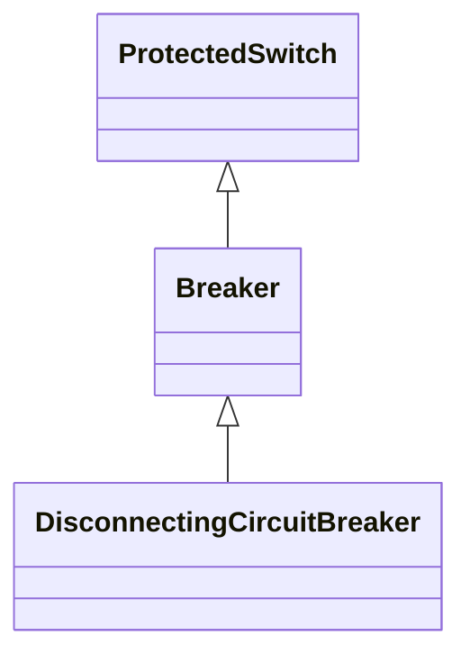

# Breaker

A mechanical switching device capable of making, carrying, and breaking currents under normal circuit conditions and also making, carrying for a specified time, and breaking currents under specified abnormal circuit conditions e.g. those of short circuit.

## Inheritance

<button class="mermaid-enlarge-button">Enlarge Diagram</button>

## Attributes

| Label | Type | Multiplicity | Comment |
|-------|------|--------------|---------|
| No attributes | | | |

