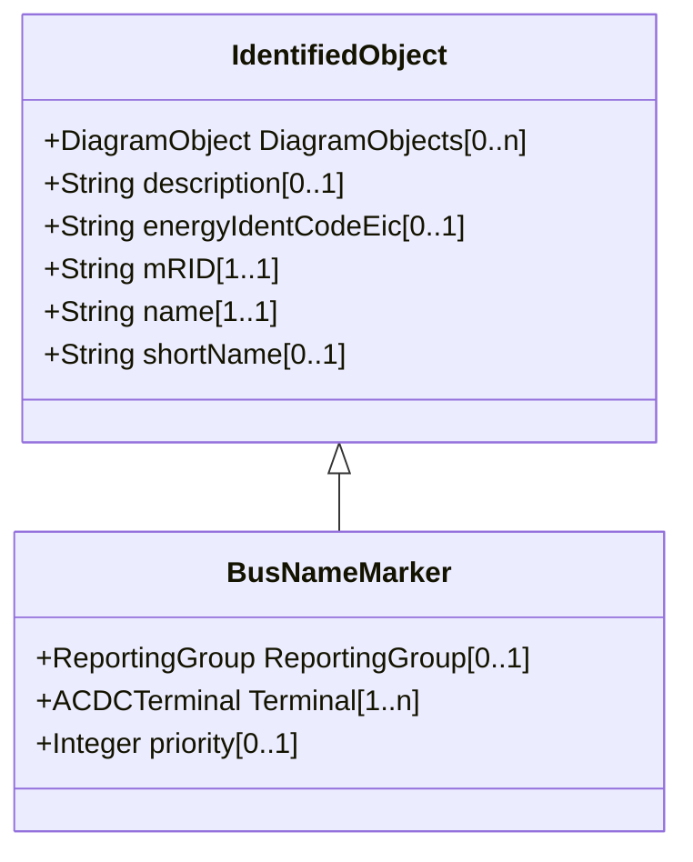

# BusNameMarker

Used to apply user standard names to TopologicalNodes. Associated with one or more terminals that are normally connected with the bus name. The associated terminals are normally connected by non-retained switches. For a ring bus station configuration, all BusbarSection terminals in the ring are typically associated. For a breaker and a half scheme, both BusbarSections would normally be associated. For a ring bus, all BusbarSections would normally be associated. For a 'straight' busbar configuration, normally only the main terminal at the BusbarSection would be associated.

## Inheritance

<button class="mermaid-enlarge-button">Enlarge Diagram</button>

## Attributes

| Label | Type | Multiplicity | Comment |
|-------|------|--------------|---------|
| ReportingGroup | [ReportingGroup](ReportingGroup.md) | 0..1 | The reporting group to which this bus name marker belongs. |
| Terminal | [ACDCTerminal](ACDCTerminal.md) | 1..n | The terminals associated with this bus name marker. |
| priority | Integer | 0..1 | Priority of bus name marker for use as topology bus name. Use 0 for do not care. Use 1 for highest priority. Use 2 as priority is less than 1 and so on. |

