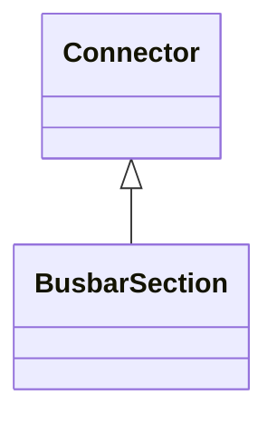

# BusbarSection

A conductor, or group of conductors, with negligible impedance, that serve to connect other conducting equipment within a single substation. Voltage measurements are typically obtained from voltage transformers that are connected to busbar sections. A bus bar section may have many physical terminals but for analysis is modelled with exactly one logical terminal.

## Inheritance

<button class="mermaid-enlarge-button">Enlarge Diagram</button>

## Attributes

| Label | Type | Multiplicity | Comment |
|-------|------|--------------|---------|
| ipMax | Float | 0..1 | Maximum allowable peak short-circuit current of busbar (Ipmax in IEC 60909-0). Mechanical limit of the busbar in the substation itself. Used for short circuit data exchange according to IEC 60909. |

