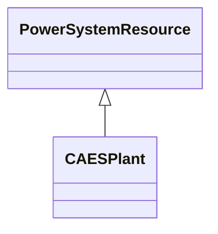

# CAESPlant

Compressed air energy storage plant.

## Inheritance

<button class="mermaid-enlarge-button">Enlarge Diagram</button>

## Attributes

| Label | Type | Multiplicity | Comment |
|-------|------|--------------|---------|
| ThermalGeneratingUnit | [ThermalGeneratingUnit](ThermalGeneratingUnit.md) | 0..1 | A thermal generating unit may be a member of a compressed air energy storage plant. |

