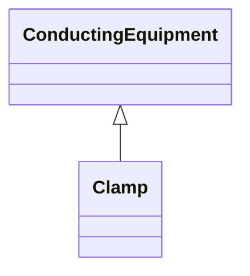

# Clamp

A Clamp is a galvanic connection at a line segment where other equipment is connected. A Clamp does not cut the line segment. A Clamp is ConductingEquipment and has one Terminal with an associated ConnectivityNode. Any other ConductingEquipment can be connected to the Clamp ConnectivityNode.

## Inheritance

<button class="mermaid-enlarge-button">Enlarge Diagram</button>

## Attributes

| Label | Type | Multiplicity | Comment |
|-------|------|--------------|---------|
| ACLineSegment | [ACLineSegment](ACLineSegment.md) | 1 | The line segment to which the clamp is connected. |
| lengthFromTerminal1 | Float | 0..1 | The length to the place where the clamp is located starting from side one of the line segment, i.e. the line segment terminal with sequence number equal to 1. |

