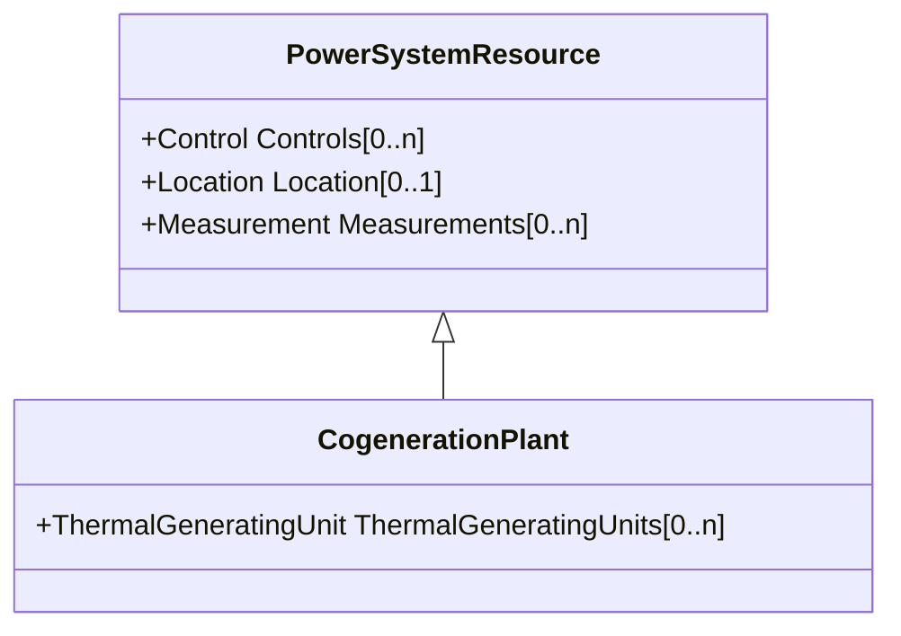

# CogenerationPlant

A set of thermal generating units for the production of electrical energy and process steam (usually from the output of the steam turbines). The steam sendout is typically used for industrial purposes or for municipal heating and cooling.

## Inheritance

<button class="mermaid-enlarge-button">Enlarge Diagram</button>

## Attributes

| Label | Type | Multiplicity | Comment |
|-------|------|--------------|---------|
| ThermalGeneratingUnits | [ThermalGeneratingUnit](ThermalGeneratingUnit.md) | 0..n | A thermal generating unit may be a member of a cogeneration plant. |

