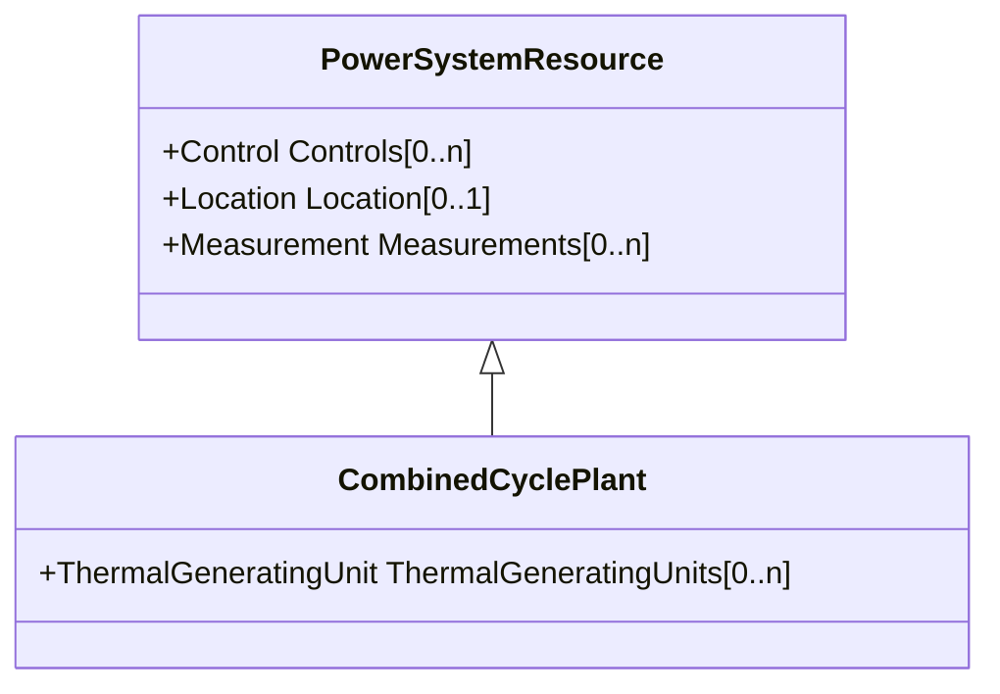

# CombinedCyclePlant

A set of combustion turbines and steam turbines where the exhaust heat from the combustion turbines is recovered to make steam for the steam turbines, resulting in greater overall plant efficiency.

## Inheritance

<button class="mermaid-enlarge-button">Enlarge Diagram</button>

## Attributes

| Label | Type | Multiplicity | Comment |
|-------|------|--------------|---------|
| ThermalGeneratingUnits | [ThermalGeneratingUnit](ThermalGeneratingUnit.md) | 0..n | A thermal generating unit may be a member of a combined cycle plant. |

