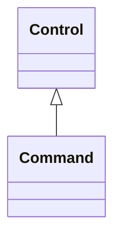

# Command

A Command is a discrete control used for supervisory control.

## Inheritance

<button class="mermaid-enlarge-button">Enlarge Diagram</button>

## Attributes

| Label | Type | Multiplicity | Comment |
|-------|------|--------------|---------|
| DiscreteValue | [DiscreteValue](DiscreteValue.md) | 1 | The MeasurementValue that is controlled. |
| ValueAliasSet | [ValueAliasSet](ValueAliasSet.md) | 0..1 | The ValueAliasSet used for translation of a Control value to a name. |
| normalValue | Integer | 1..1 | Normal value for Control.value e.g. used for percentage scaling. |
| value | Integer | 1..1 | The value representing the actuator output. |

