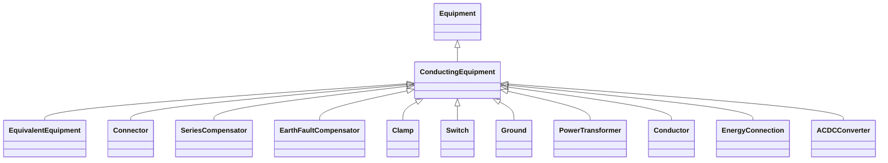

# ConductingEquipment

The parts of the AC power system that are designed to carry current or that are conductively connected through terminals.

## Inheritance

<button class="mermaid-enlarge-button">Enlarge Diagram</button>

## Attributes

| Label | Type | Multiplicity | Comment |
|-------|------|--------------|---------|
| BaseVoltage | [BaseVoltage](BaseVoltage.md) | 0..1 | Base voltage of this conducting equipment. Use only when there is no voltage level container used and only one base voltage applies. For example, not used for transformers. |
| SvStatus | [SvStatus](SvStatus.md) | 0..1 | The status state variable associated with this conducting equipment. |
| Terminals | [Terminal](Terminal.md) | 0..n | Conducting equipment have terminals that may be connected to other conducting equipment terminals via connectivity nodes or topological nodes. |

