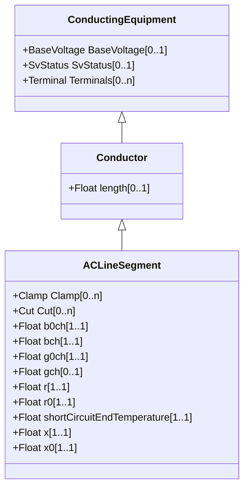

# Conductor

Combination of conducting material with consistent electrical characteristics, building a single electrical system, used to carry current between points in the power system.

## Inheritance

<button class="mermaid-enlarge-button">Enlarge Diagram</button>

## Attributes

| Label | Type | Multiplicity | Comment |
|-------|------|--------------|---------|
| length | Float | 0..1 | Segment length for calculating line section capabilities. |

