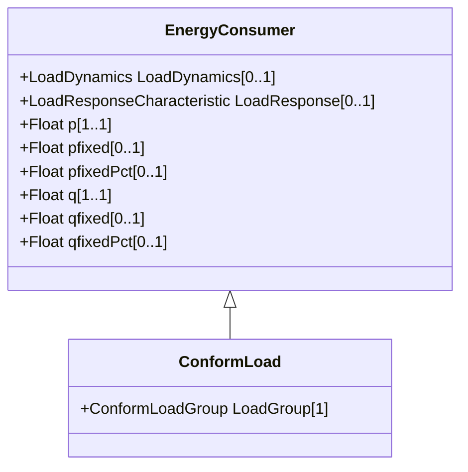

# ConformLoad

ConformLoad represent loads that follow a daily load change pattern where the pattern can be used to scale the load with a system load.

## Inheritance

<button class="mermaid-enlarge-button">Enlarge Diagram</button>

## Attributes

| Label | Type | Multiplicity | Comment |
|-------|------|--------------|---------|
| LoadGroup | [ConformLoadGroup](ConformLoadGroup.md) | 1 | Group of this ConformLoad. |

