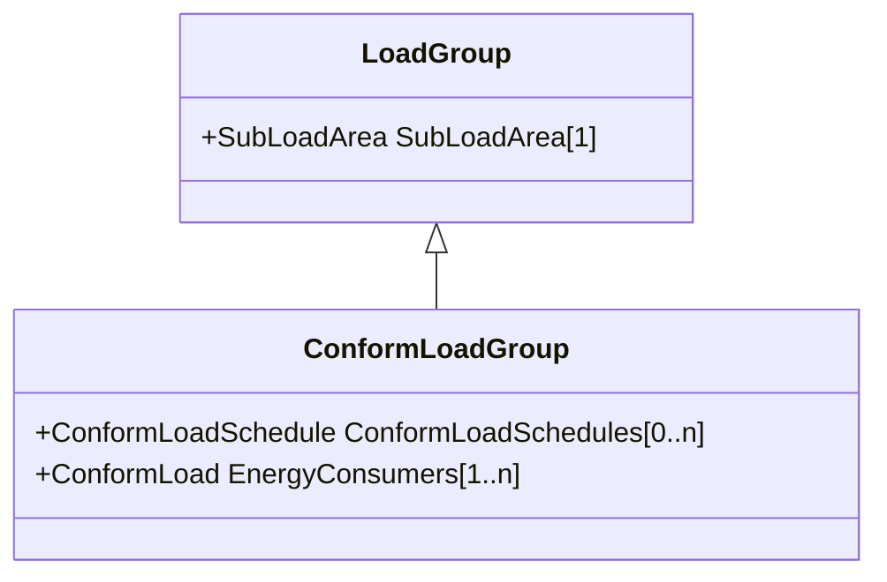

# ConformLoadGroup

A group of loads conforming to an allocation pattern.

## Inheritance

<button class="mermaid-enlarge-button">Enlarge Diagram</button>

## Attributes

| Label | Type | Multiplicity | Comment |
|-------|------|--------------|---------|
| ConformLoadSchedules | [ConformLoadSchedule](ConformLoadSchedule.md) | 0..n | The ConformLoadSchedules in the ConformLoadGroup. |
| EnergyConsumers | [ConformLoad](ConformLoad.md) | 1..n | Conform loads assigned to this ConformLoadGroup. |

