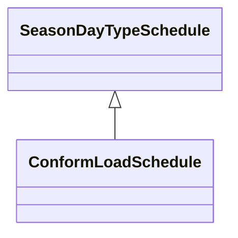

# ConformLoadSchedule

A curve of load versus time (X-axis) showing the active power values (Y1-axis) and reactive power (Y2-axis) for each unit of the period covered. This curve represents a typical pattern of load over the time period for a given day type and season.

## Inheritance

<button class="mermaid-enlarge-button">Enlarge Diagram</button>

## Attributes

| Label | Type | Multiplicity | Comment |
|-------|------|--------------|---------|
| ConformLoadGroup | [ConformLoadGroup](ConformLoadGroup.md) | 1 | The ConformLoadGroup where the ConformLoadSchedule belongs. |

