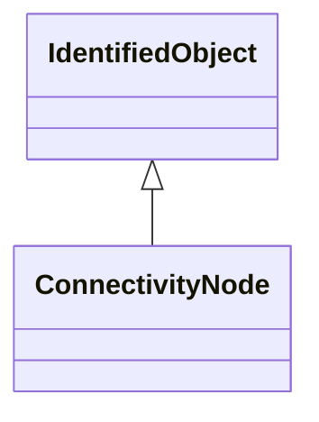

# ConnectivityNode

Connectivity nodes are points where terminals of AC conducting equipment are connected together with zero impedance.

## Inheritance

<button class="mermaid-enlarge-button">Enlarge Diagram</button>

## Attributes

| Label | Type | Multiplicity | Comment |
|-------|------|--------------|---------|
| BoundaryPoint | [BoundaryPoint](BoundaryPoint.md) | 0..1 | The boundary point associated with the connectivity node. |
| ConnectivityNodeContainer | [ConnectivityNodeContainer](ConnectivityNodeContainer.md) | 1 | Container of this connectivity node. |
| Terminals | [Terminal](Terminal.md) | 0..n | Terminals interconnected with zero impedance at a this connectivity node. |
| TopologicalNode | [TopologicalNode](TopologicalNode.md) | 1 | The topological node to which this connectivity node is assigned. May depend on the current state of switches in the network. |

