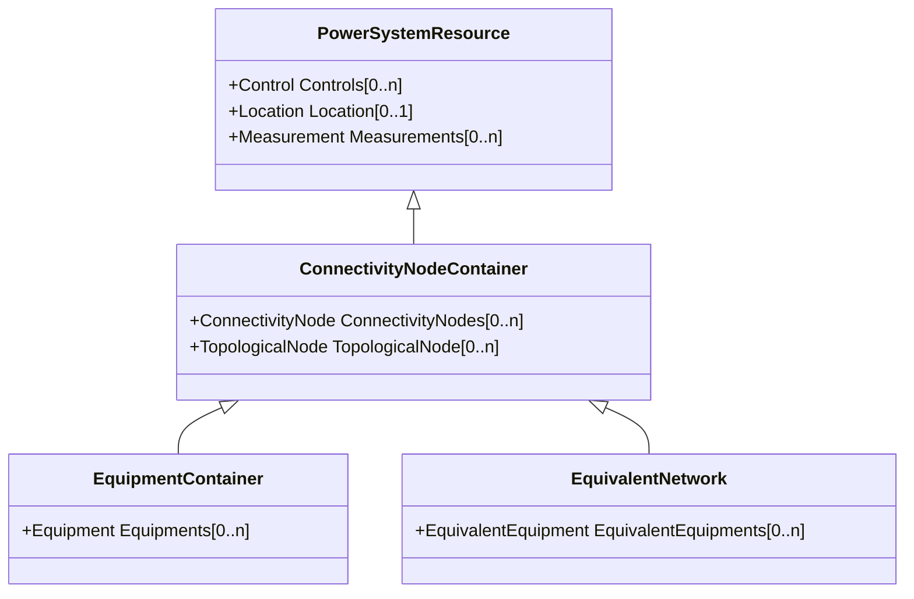

# ConnectivityNodeContainer

A base class for all objects that may contain connectivity nodes or topological nodes.

## Inheritance

<button class="mermaid-enlarge-button">Enlarge Diagram</button>

## Attributes

| Label | Type | Multiplicity | Comment |
|-------|------|--------------|---------|
| ConnectivityNodes | [ConnectivityNode](ConnectivityNode.md) | 0..n | Connectivity nodes which belong to this connectivity node container. |
| TopologicalNode | [TopologicalNode](TopologicalNode.md) | 0..n | The topological nodes which belong to this connectivity node container. |

