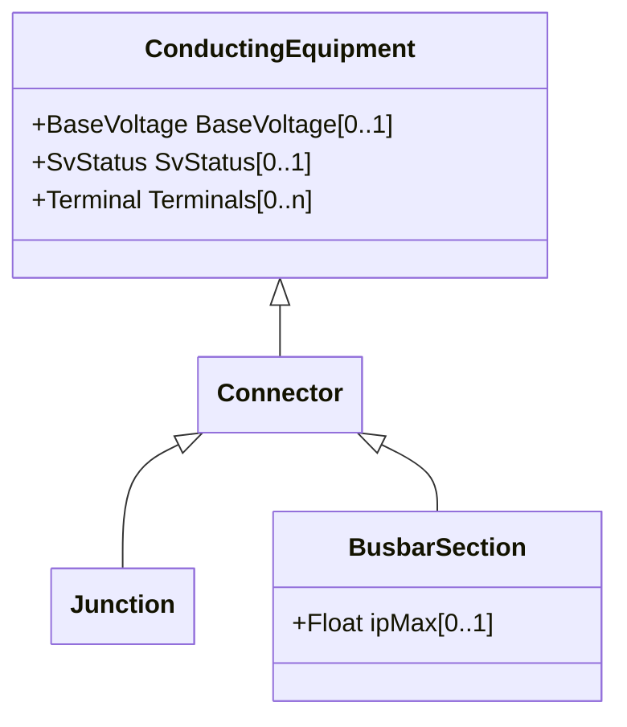

# Connector

A conductor, or group of conductors, with negligible impedance, that serve to connect other conducting equipment within a single substation and are modelled with a single logical terminal.

## Inheritance

<button class="mermaid-enlarge-button">Enlarge Diagram</button>

## Attributes

| Label | Type | Multiplicity | Comment |
|-------|------|--------------|---------|
| No attributes | | | |

