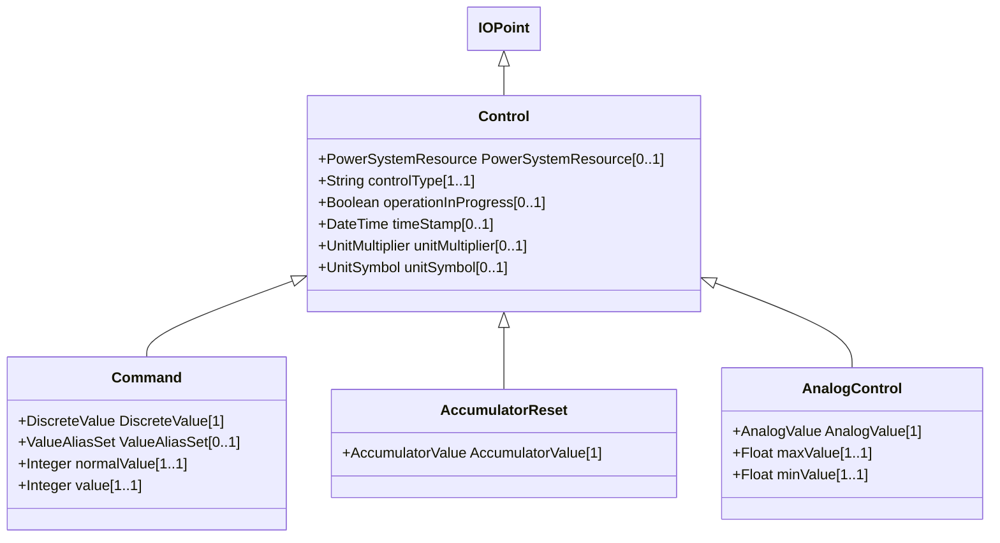

# Control

Control is used for supervisory/device control. It represents control outputs that are used to change the state in a process, e.g. close or open breaker, a set point value or a raise lower command.

## Inheritance

<button class="mermaid-enlarge-button">Enlarge Diagram</button>

## Attributes

| Label | Type | Multiplicity | Comment |
|-------|------|--------------|---------|
| PowerSystemResource | [PowerSystemResource](PowerSystemResource.md) | 0..1 | Regulating device governed by this control output. |
| controlType | String | 1..1 | Specifies the type of Control. For example, this specifies if the Control represents BreakerOpen, BreakerClose, GeneratorVoltageSetPoint, GeneratorRaise, GeneratorLower, etc. |
| operationInProgress | Boolean | 0..1 | Indicates that a client is currently sending control commands that has not completed. |
| timeStamp | DateTime | 0..1 | The last time a control output was sent. |
| unitMultiplier | [UnitMultiplier](UnitMultiplier.md) | 0..1 | The unit multiplier of the controlled quantity. |
| unitSymbol | [UnitSymbol](UnitSymbol.md) | 0..1 | The unit of measure of the controlled quantity. |

