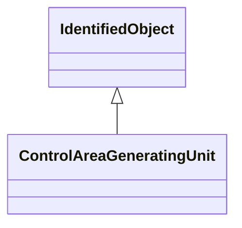

# ControlAreaGeneratingUnit

A control area generating unit. This class is needed so that alternate control area definitions may include the same generating unit. It should be noted that only one instance within a control area should reference a specific generating unit.

## Inheritance

<button class="mermaid-enlarge-button">Enlarge Diagram</button>

## Attributes

| Label | Type | Multiplicity | Comment |
|-------|------|--------------|---------|
| ControlArea | [ControlArea](ControlArea.md) | 1 | The parent control area for the generating unit specifications. |
| GeneratingUnit | [GeneratingUnit](GeneratingUnit.md) | 1 | The generating unit specified for this control area. Note that a control area should include a GeneratingUnit only once. |

