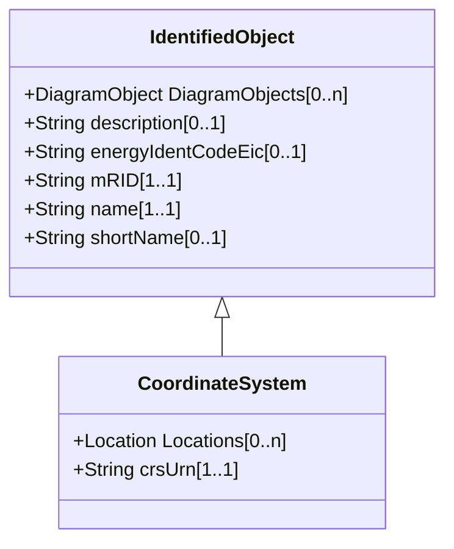

# CoordinateSystem

Coordinate reference system.

## Inheritance

<button class="mermaid-enlarge-button">Enlarge Diagram</button>

## Attributes

| Label | Type | Multiplicity | Comment |
|-------|------|--------------|---------|
| Locations | [Location](Location.md) | 0..n | All locations described with position points in this coordinate system. |
| crsUrn | String | 1..1 | A Uniform Resource Name (URN) for the coordinate reference system (crs) used to define 'Location.PositionPoints'. An example would be the European Petroleum Survey Group (EPSG) code for a coordinate reference system, defined in URN under the Open Geospatial Consortium (OGC) namespace as: urn:ogc:def:crs:EPSG::XXXX, where XXXX is an EPSG code (a full list of codes can be found at the EPSG Registry web site http://www.epsg-registry.org/). To define the coordinate system as being WGS84 (latitude, longitude) using an EPSG OGC, this attribute would be urn:ogc:def:crs:EPSG::4236. A profile should limit this code to a set of allowed URNs agreed to by all sending and receiving parties. |

