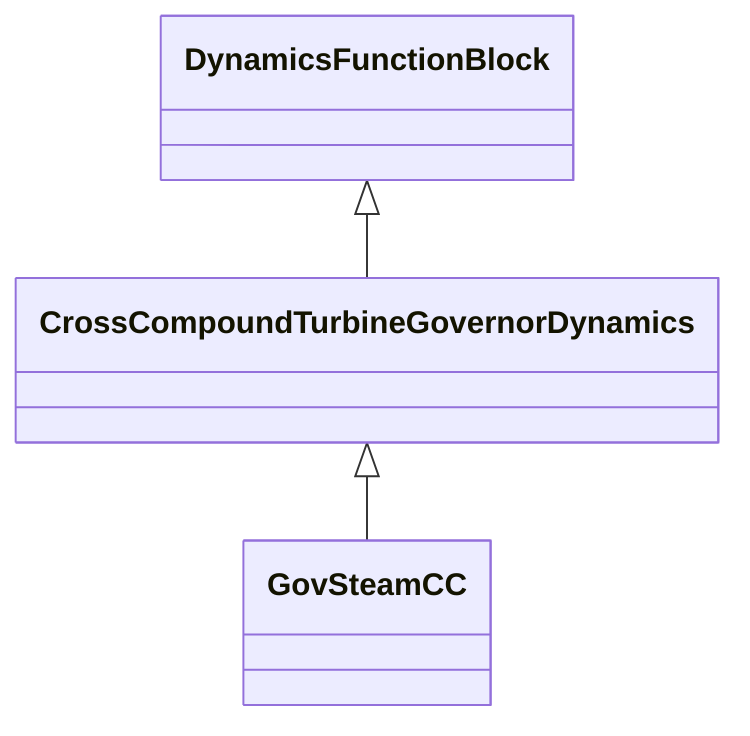

# CrossCompoundTurbineGovernorDynamics

Turbine-governor cross-compound function block whose behaviour is described by reference to a standard model or by definition of a user-defined model.

## Inheritance

<button class="mermaid-enlarge-button">Enlarge Diagram</button>

## Attributes

| Label | Type | Multiplicity | Comment |
|-------|------|--------------|---------|
| HighPressureSynchronousMachineDynamics | [SynchronousMachineDynamics](SynchronousMachineDynamics.md) | 1 | High-pressure synchronous machine with which this cross-compound turbine governor is associated. |
| LowPressureSynchronousMachineDynamics | [SynchronousMachineDynamics](SynchronousMachineDynamics.md) | 1 | Low-pressure synchronous machine with which this cross-compound turbine governor is associated. |

