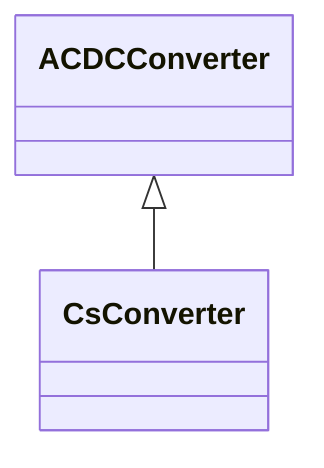

# CsConverter

DC side of the current source converter (CSC). The firing angle controls the dc voltage at the converter, both for rectifier and inverter. The difference between the dc voltages of the rectifier and inverter determines the dc current. The extinction angle is used to limit the dc voltage at the inverter, if needed, and is not used in active power control. The firing angle, transformer tap position and number of connected filters are the primary means to control a current source dc line. Higher level controls are built on top, e.g. dc voltage, dc current and active power. From a steady state perspective it is sufficient to specify the wanted active power transfer (ACDCConverter.targetPpcc) and the control functions will set the dc voltage, dc current, firing angle, transformer tap position and number of connected filters to meet this. Therefore attributes targetAlpha and targetGamma are not applicable in this case. The reactive power consumed by the converter is a function of the firing angle, transformer tap position and number of connected filter, which can be approximated with half of the active power. The losses is a function of the dc voltage and dc current. The attributes minAlpha and maxAlpha define the range of firing angles for rectifier operation between which no discrete tap changer action takes place. The range is typically 10-18 degrees. The attributes minGamma and maxGamma define the range of extinction angles for inverter operation between which no discrete tap changer action takes place. The range is typically 17-20 degrees.

## Inheritance

<button class="mermaid-enlarge-button">Enlarge Diagram</button>

## Attributes

| Label | Type | Multiplicity | Comment |
|-------|------|--------------|---------|
| CSCDynamics | [CSCDynamics](CSCDynamics.md) | 0..1 | Current source converter dynamics model used to describe dynamic behaviour of this converter. |
| alpha | Float | 1..1 | Firing angle that determines the dc voltage at the converter dc terminal. Typical value between 10 degrees and 18 degrees for a rectifier. It is converter’s state variable, result from power flow. The attribute shall be a positive value. |
| gamma | Float | 1..1 | Extinction angle. It is used to limit the dc voltage at the inverter if needed. Typical value between 17 degrees and 20 degrees for an inverter. It is converter’s state variable, result from power flow. The attribute shall be a positive value. |
| maxAlpha | Float | 0..1 | Maximum firing angle. It is converter’s configuration data used in power flow. The attribute shall be a positive value. |
| maxGamma | Float | 0..1 | Maximum extinction angle. It is converter’s configuration data used in power flow. The attribute shall be a positive value. |
| maxIdc | Float | 0..1 | The maximum direct current (Id) on the DC side at which the converter should operate. It is converter’s configuration data use in power flow. The attribute shall be a positive value. |
| minAlpha | Float | 0..1 | Minimum firing angle. It is converter’s configuration data used in power flow. The attribute shall be a positive value. |
| minGamma | Float | 0..1 | Minimum extinction angle. It is converter’s configuration data used in power flow. The attribute shall be a positive value. |
| minIdc | Float | 0..1 | The minimum direct current (Id) on the DC side at which the converter should operate. It is converter’s configuration data used in power flow. The attribute shall be a positive value. |
| operatingMode | [CsOperatingModeKind](CsOperatingModeKind.md) | 1..1 | Indicates whether the DC pole is operating as an inverter or as a rectifier. It is converter’s control variable used in power flow. |
| pPccControl | [CsPpccControlKind](CsPpccControlKind.md) | 1..1 | Kind of active power control. |
| ratedIdc | Float | 0..1 | Rated converter DC current, also called IdN. The attribute shall be a positive value. It is converter’s configuration data used in power flow. |
| targetAlpha | Float | 0..1 | Target firing angle. It is converter’s control variable used in power flow. It is only applicable for rectifier if continuous tap changer control is used. Allowed values are within the range minAlpha<=targetAlpha<=maxAlpha. The attribute shall be a positive value. |
| targetGamma | Float | 0..1 | Target extinction angle. It is converter’s control variable used in power flow. It is only applicable for inverter if continuous tap changer control is used. Allowed values are within the range minGamma<=targetGamma<=maxGamma. The attribute shall be a positive value. |
| targetIdc | Float | 0..1 | DC current target value. It is converter’s control variable used in power flow. The attribute shall be a positive value. |

