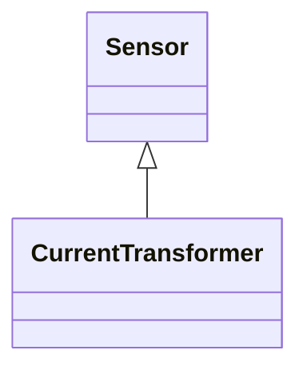

# CurrentTransformer

Instrument transformer used to measure electrical qualities of the circuit that is being protected and/or monitored. Typically used as current transducer for the purpose of metering or protection. A typical secondary current rating would be 5A.

## Inheritance

<button class="mermaid-enlarge-button">Enlarge Diagram</button>

## Attributes

| Label | Type | Multiplicity | Comment |
|-------|------|--------------|---------|
| No attributes | | | |

