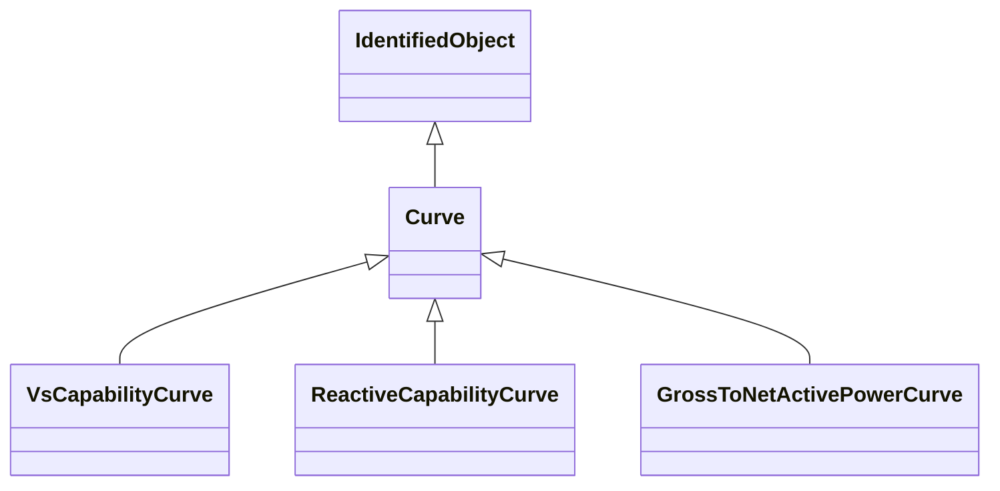

# Curve

A multi-purpose curve or functional relationship between an independent variable (X-axis) and dependent (Y-axis) variables.

## Inheritance

<button class="mermaid-enlarge-button">Enlarge Diagram</button>

## Attributes

| Label | Type | Multiplicity | Comment |
|-------|------|--------------|---------|
| CurveDatas | [CurveData](CurveData.md) | 1..n | The point data values that define this curve. |
| curveStyle | [CurveStyle](CurveStyle.md) | 1..1 | The style or shape of the curve. |
| xUnit | [UnitSymbol](UnitSymbol.md) | 1..1 | The X-axis units of measure. |
| y1Unit | [UnitSymbol](UnitSymbol.md) | 1..1 | The Y1-axis units of measure. |
| y2Unit | [UnitSymbol](UnitSymbol.md) | 0..1 | The Y2-axis units of measure. |

