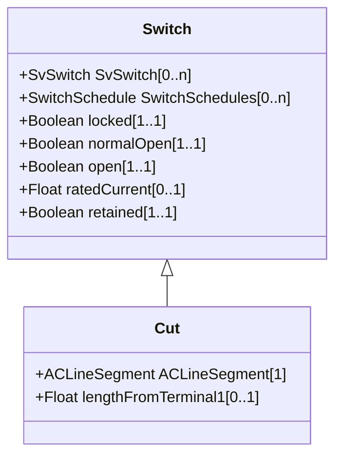

# Cut

A cut separates a line segment into two parts. The cut appears as a switch inserted between these two parts and connects them together. As the cut is normally open there is no galvanic connection between the two line segment parts. But it is possible to close the cut to get galvanic connection. The cut terminals are oriented towards the line segment terminals with the same sequence number. Hence the cut terminal with sequence number equal to 1 is oriented to the line segment's terminal with sequence number equal to 1. The cut terminals also act as connection points for jumpers and other equipment, e.g. a mobile generator. To enable this, connectivity nodes are placed at the cut terminals. Once the connectivity nodes are in place any conducting equipment can be connected at them.

## Inheritance

<button class="mermaid-enlarge-button">Enlarge Diagram</button>

## Attributes

| Label | Type | Multiplicity | Comment |
|-------|------|--------------|---------|
| ACLineSegment | [ACLineSegment](ACLineSegment.md) | 1 | The line segment to which the cut is applied. |
| lengthFromTerminal1 | Float | 0..1 | The length to the place where the cut is located starting from side one of the cut line segment, i.e. the line segment Terminal with sequenceNumber equal to 1. |

