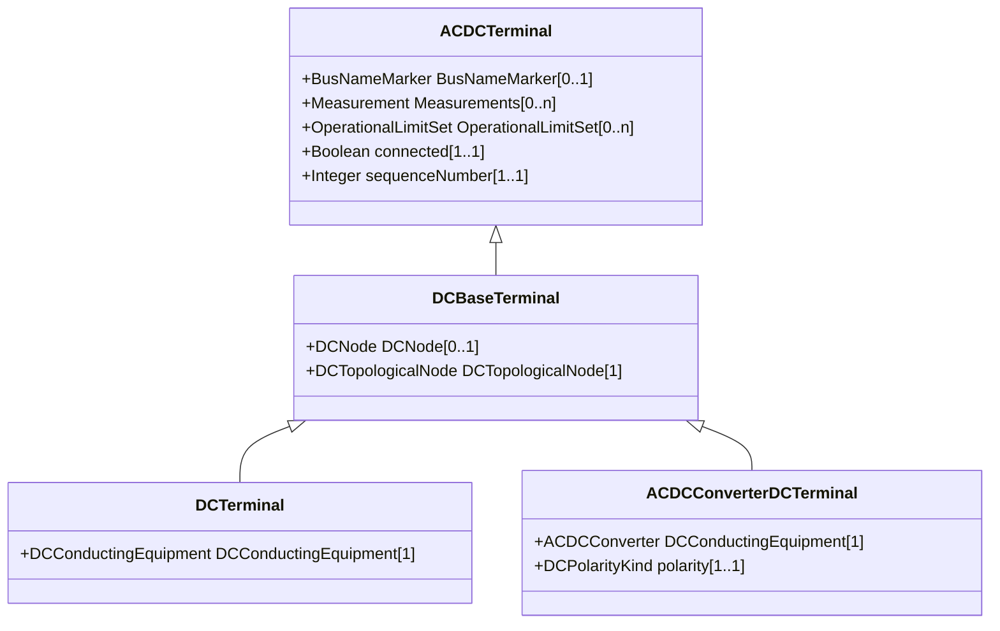

# DCBaseTerminal

An electrical connection point at a piece of DC conducting equipment. DC terminals are connected at one physical DC node that may have multiple DC terminals connected. A DC node is similar to an AC connectivity node. The model requires that DC connections are distinct from AC connections.

## Inheritance

<button class="mermaid-enlarge-button">Enlarge Diagram</button>

## Attributes

| Label | Type | Multiplicity | Comment |
|-------|------|--------------|---------|
| DCNode | [DCNode](DCNode.md) | 0..1 | The DC connectivity node to which this DC base terminal connects with zero impedance. |
| DCTopologicalNode | [DCTopologicalNode](DCTopologicalNode.md) | 1 | See association end Terminal.TopologicalNode. |

