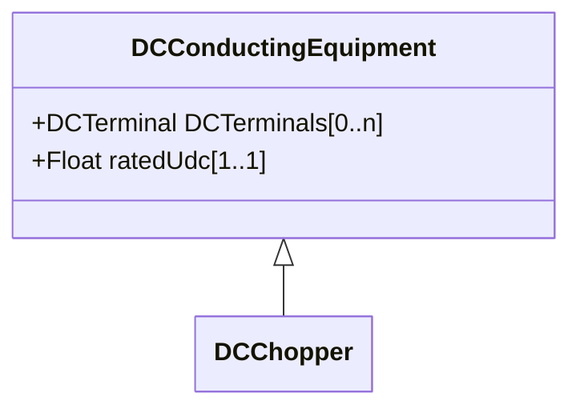

# DCChopper

Low resistance equipment used in the internal DC circuit to balance voltages. It has typically positive and negative pole terminals and a ground.

## Inheritance

<button class="mermaid-enlarge-button">Enlarge Diagram</button>

## Attributes

| Label | Type | Multiplicity | Comment |
|-------|------|--------------|---------|
| No attributes | | | |

